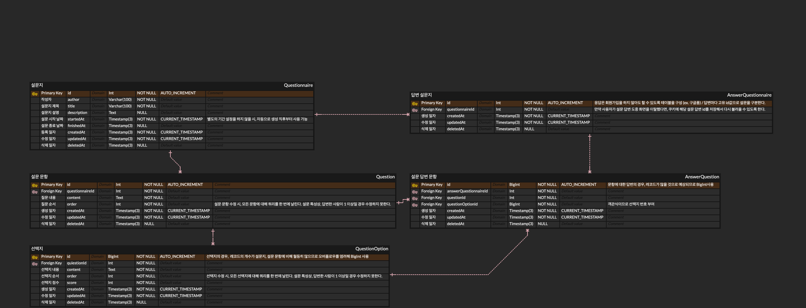

# 마음 연구소 과제입니다.

## 데이터베이스



- 링크
<iframe width="600" height="336" src="https://www.erdcloud.com/p/CtuA9BphnfQsz8FAi" frameborder="0" allowfullscreen></iframe>

## 설명

- 도커를 사용하여 실행하는 방법을 소개합니다.
- `/api-docs` 경로에 Swagger를 작성해두었습니다. 테스트 시, 스웨거를 이용하시면 됩니다.
- 간단한 e2e Test를 작성해두었습니다. 명령어는 `npm run test:e2e` 입니다.

### 유의사항

- 유저 테이블은 따로 만들지 않았습니다.
- 로그인을 따로 구현하지 않았습니다. 작성자 명으로만 설문을 구분합니다.
- 임시저장 같은 기능은 따로 구현하지 않았습니다.
- 설문지, 문항, 선택지, 답변 CRUD 모두 구현하였습니다..
- 설문지 완료의 경우 컴포넌트(설문 답변) 하나하나 마다 생성하게 하였으므로, 설문지 완료 버튼을 클릭하면 따로 완료 설문지 api로 Redirect시키면 됩니다.
- 완료된 설문지 확인의 경우 `GET /api/answer-questionnaire/{id}` 를 통해 읽어올 수 있도록 하였습니다.
- 답변 설문지의 경우 따로 볼 수 있게 하지 않았습니다. 사용자가 화면을 벗어날 시, 임시저장을 위해 불러올 수 있도록 id값을 암호화하여 쿠키에 넣어줄 때 사용하는 용도로만 만들어두었습니다.

### 기능

**설문지**

- `POST /api/questionnaire`
  - 설문지 생성 : 설문지 생성은 생성 버튼을 클릭할 시, 설문지만 따로 생성할 수 있도록 하였습니다.
- `GET /api/questionnaire/{id}`
  - 설문지 읽기 : 한 설문지에 대한 자세한 내용들(질문, 선택지 포함)을 읽어옵니다.
- `PUT /api/questionnaire/{id}`
  - 설문지 수정 : 설문지를 수정합니다. 제목과 설명 위주로 수정 가능합니다. 질문과 선택지는 따로 수정해야합니다.
- `DELETE /api/questionnaire/{id}`
  - 설문지 삭제 : 설문지를 삭제합니다. SoftDelete를 적용합니다. 이 때, 질문과 선택지 또한 cascade로 SoftDelete됩니다.

**질문(설문 문항)**

- `POST /api/question`
  - 질문 생성 : 설문지에 대한 질문을 생성합니다. 이 때, order는 프론트에서 현재 존재하는 질문들의 순서를 파악하여 넘겨줍니다. (ex. 현재 설문지에 대한 질문에 2개 존재하는 상황에서 하나의 질문들 더 생성할 시, order=3이 들어가도록)
- `GET /api/question/list`
  - 질문 목록 읽기 : 해당 설문지에 대한 질문 목록을 불러옵니다. 이 때, 질문에 대한 선택지들도 함께 불러옵니다.
- `PUT /api/question/{id}`
  - 질문 수정 : 설문 문항을 수정합니다. order를 위하여 설문 수정시 프론트 측에서 한번에 Update를 날려주어야 합니다.
- `DELETE /api/question/{id}`
  - 질문 삭제 : 질문을 삭제합니다. 이 때, 질문에 대한 선택지 또한 함께 SoftDelete됩니다.

**선택지**

- `POST /api/question-option`
  - 선택지 생성 : 질문에 대한 선택지를 생성합니다. 이 때, order는 프론트에서 현재 존재하는 선택지들의 순서를 파악하여 넘겨줍니다.
- `GET /api/question-option`
  - 선택지 목록 불러오기 : 질문에 대한 선택지 목록을 불러옵니다.
- `PUT /api/question-option/{id}`
  - 선택지 수정 : 선택지를 수정합니다.
- `DELETE /api/question-option/{id}`
  - 선택지 삭제 : 선택지를 삭제합니다.

**답변**

- `POST /api/answer-questionnaire`
  - 답변 설문지 생성 : 답변에 대한 설문지를 생성합니다.
- `GET /api/answer-questionnaire`
  - 답변 설문지 목록 읽기 : 설문지에 대한 답변 설문지 목록을 불러옵니다.
- `GET /api/answer-questionnaire/{id}`
  - 답변 설문지 읽기 : 답변 설문지에 대한 자세한 내용을 읽어옵니다.
- `DELETE /api/answer-questionnaire/{id}`
  - 답변 설문지 삭제 : 답변 설문지를 삭제합니다.
- `POST /api/answer-question`
  - 답변 생성 : 답변 설문지에 대한 답변을 생성합니다.
- `PUT /api/answer-question/{id}`
  - 답변 수정 : 답변을 수정합니다.

---

## 실행 방법

### 사전 준비

- docker와 docker-compose가 설치되어 있어야 합니다.

### 명령어

1. 먼저, 프로젝트를 로컬로 가져옵니다.

```bash
git clone https://github.com/8471919/feeling_laboratory
```

</br>

2. `.env` 파일을 생성하고, 프로젝트 폴더 최상위에 위치합니다. (package.json과 동일한 위치) 파일 내용은 아래와 같습니다.

```
NEST_PORT=4000

# DB 관련 설정
DB_HOST=postgres
DB_PORT=5432
DB_USERNAME=test
DB_PASSWORD=test1234
DB_DATABASE=questionnaire

POSTGRES_USER=test
POSTGRES_DB=questionnaire
POSTGRES_PASSWORD=test1234
TZ=Asia/Seoul
```

3. docker compose를 이용하여 실행시킵니다.

- 이 때, 도커 버전에 따라 실행 명령이 상이할 수 있습니다.

```bash

docker-compose up -d

# 위 명령으로 실행 불가능하다면
docker compose up -d

```

4. 컨테이너가 실행이 되었다면, 스웨거 문서를 들어갑니다.

- `http://127.0.0.1:4000/api-docs` 로 접속하실 수 있습니다.
